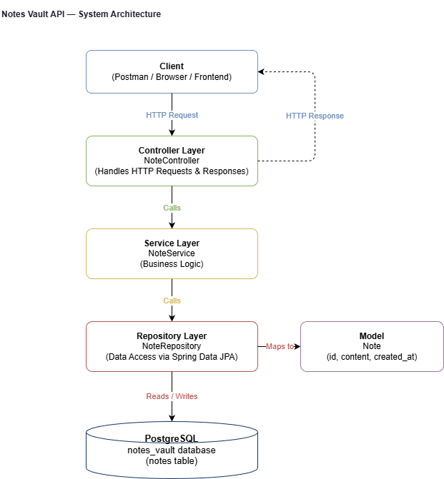

# Notes Vault API

A lightweight backend service for creating, viewing, and deleting notes.
Built with Java and Spring Boot, backed by PostgreSQL, and containerized
with Docker.

---

## System Architecture

The diagram below shows how the system is structured from the client
down through each layer to the database.

### How it works

- The **Client** sends HTTP requests to the API
- The **Controller** receives the request and delegates to the service
- The **Service** contains the business logic and calls the repository
- The **Repository** handles all database operations via Spring Data JPA
- The **Model** defines what a Note looks like in the database
- **PostgreSQL** persists the data in the `notes_vault` database

---

## Tech Choices

### Java and Spring Boot
Java is the primary language for this project. Spring Boot makes it 
straightforward to build a production-ready REST API without a lot of 
boilerplate setup. It comes with everything needed out of the box — 
a web server, dependency injection, and data access tools — which lets 
me focus on writing clean, well structured code rather than configuration.
Java and Spring Boot are what I am most comfortable with, and they have 
been a consistent part of my journey from UCCS Web Services to Parsons 
and across various personal projects. It is a reliable backend setup that 
I have genuinely come to enjoy and appreciate the more I work with it.

### PostgreSQL
PostgreSQL is a reliable, production grade relational database. The notes 
data model is structured and relational by nature, making SQL a natural 
fit. PostgreSQL is also widely used in production environments and pairs 
cleanly with Spring Data JPA. It is my favorite database by far — I was 
first introduced to it professionally at Parsons and FreshBI, and what 
keeps drawing me back is its consistency and power. In my experience it 
is a true workhorse in the professional world and I do not see that 
changing anytime soon.

### Docker and Docker Compose
Docker ensures the application runs consistently regardless of the machine 
it is running on. Docker Compose allows the Spring Boot app and PostgreSQL 
database to be spun up together with a single command, removing any 
dependency on local environment setup. Containerization is something I 
have genuinely fallen in love with as a technology. The ability to package 
an application with all of its dependencies and run it anywhere without 
friction is remarkable. In my opinion technologies like Docker are a big 
part of what has driven the explosion of growth in the software world, and 
I use it with just about everything I build.

### Maven
Maven manages the project dependencies and build lifecycle. It keeps 
dependency management clean and makes the project easy to build and 
test from the command line with a single command. When working with Java 
and Spring Boot, Maven is a natural fit. The pom.xml file gives you a 
clear and organized way to manage dependencies and I have found it to be 
a solid and dependable tool across every Java project I have worked on.

### GitHub
GitHub is used for version control and project management throughout this 
project. All development follows a feature branching workflow where each 
story has its own branch, pull request, and traceable commit history back 
to the original issue. This mirrors the collaborative development workflows 
used on real engineering teams and was an intentional part of how this 
project was built from day one.

### VS Code
VS Code is the primary development environment for this project. With the 
Java Extension Pack and Spring Boot Extension Pack installed it provides 
real time feedback on annotations, JPA mappings, and test runners that 
make development faster and more reliable. It is a lightweight but powerful 
editor that I reach for on most projects.

### React (Planned)
A React frontend is planned as a future enhancement to this project. The 
goal is to build a simple UI that consumes the Notes Vault API and 
transforms it into a full stack application. React is the natural choice 
given its widespread adoption and its ability to connect cleanly to a 
REST API backend.

--- 

